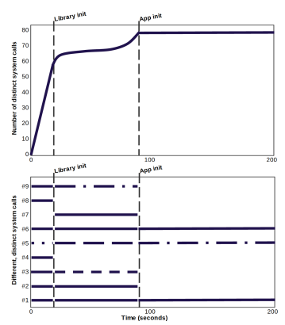

<!-- _class: title gaia -->

# <!-- fit --> Data-driven Software Security: Models and Methods
##### Úlfar Erlingsson
##### Google, Inc.
# <br/>:computer: <br/><br/>
###### Presented by William Johnson and Kellan Christ

---

<!-- paginate: true -->

# Outline :scroll:
<style scoped>section { font-size: 26px; }</style>
- Author's Background
- Introduction
  `a. Security Models & Setting Policies`
  `b. Low-level Software Policies`
- Data-Driven Software Security Model
  `a. Anomaly and Intrusion Detection`
  `b. Open Questions & Formal Modeling`
- Methods for Data-driven Software Security
  `a. Efficient Monitoring`
  `b. Privacy Preservation`
  `c. Match User Expectations and Software Permissions`
- Conclusion

---

# Author's Background :book:
- **Úlfar Erlingsson**, Chief Architect for cloud security firm `Lacework`, with focus on framework for end-to-end visibility across cloud, and detection of threats, vulnerabilities, misconfigues, etc.
- Previously head of Security Research Group at `Google`

---

# Introduction :electric_plug:
<style scoped>section { font-size: 30px; }</style>
- Security a concern in 1950s and became prevalent by late 1960s and 1970s
- Key figures:
  - `Jerome Saltzer` `(MIT)`
    - Multics Operating System (time-sharing)
    - End-to-end principle with David Reed and David Clark
  - `Michael Schroeder` `(MIT)`
    - Needham–Schroeder key transport protocol (symmetric encryption)
  - `Butler Lampson` `(UC Berkeley)`
    - 1992 ACM Turing Award winner for contribution to personal computing

---

# Introduction :electric_plug:
<style scoped>section { font-size: 28px; }</style>
- Saltzer, Shroeder and notably **Lampson** contributed to formalizing computer security and defining important security models: **access-control lists, capabilities, etc.**
- **Principle of Least Privilege:** permit only the required low-level executions, unless programmer requires explicit, special permission
- Software security is a **form of correctness**
- One-to-one correspondence between security and programming
```
In Security                     In Programming

Security policy         =       Functional specification
Security mechanism      =       Software implementation
Security assurance      =       Program correctness
Security model          =       Programming methodology
```

<!--
# NOTES

- Functional specification: formal document to describe product (in this case program's) intended capabilities
- Security policy: the objectives and constraints (what's allowed happen)
(usually not focus of the programmer)

- Implementation/Enforcement Mechanism: implement the specification, enforce policy correctly

- Correctness/Assurance: behaves as intended, verifiable (no violations)

- Methodology: establish correctness via programming paradigms (such as functional programming vs. imperative programming)

Challenge in software and software security is in specification and policy

-->

---

# <!-- fit --> Introduction: Security Models & Setting Policies :shield:
- Secure computing has stagnant progress
- Challenges compared to traditional security: 
  - Universal networking as doors for attack surfaces
  - Effective defense requires absence of vulnerabilities
- Task may be easy to approach in one Turing-complete language, but difficult in other » same issue with security models
- Functional specification is hard to get right
  - Difficult to specify intended functionality
  - Specification likely to be wrong

 <!--
# NOTES (Relevant Example)
..
Why is functional specification a difficult area to get right?
..
It's natural to find flaws in specifications, and this is especially true for large software with wide range of libraries/tools/etc. 
..
There's a challenge in proving correctness. An extreme case is in development of encryption models where correctness is mathematically dependent, and can be overlooked. Also why you may hear phrases like "never roll your own crypto", because such specification is hard to get right.

-->

---

# <!-- fit --> Introduction: Low-level Software Policies :minidisc:
- Good security model has simple policies to thwart low-level software vulnerabilities
- Placement of Stack Guard / Canary
  - **Model:** nonce / random value placed **before** the base pointer and instruction pointer
  - **Implementation:** `-fstack-protector` (Enforced in compilers by default)
  - **Policy:** one should not be able to mess with return value stored on the stack

  <!-- 
  # NOTES
  In other words, keep program to work/behave as the programmer intend it.
  ..
  This example ensures integrity:
  - Control-flow Integrity: cannot alter return address to jump to arbitrary function
  - Data-flow Integrity: mitigate overwriting adjacent memory
  -->

---

# <!-- fit --> Introduction: Low-level Software Policies :minidisc:
- Data-driven Software Security Application
  - Software is more complex
  - Data-driven approach is effective (as seen in fighting spam and abuse)
  - Past information to figure out what should happen in future
    - Policies can be derived from **historical evidence** of captured executions » used to minimize attack surfaces (i.e. policy is **empirical**)
    - Enforce: Focus primarily on events that should not occur

<!--
# NOTES
Analog: Think of monitoring in firewall or IDS
Firewall and IDS often have a log of activities and other executions from users
  - Maybe identify port scanner
  - Identify suspicious activity
If you have past information, you can use information to prevent disaster in the future
..
Example:
- In past (discover port scanner) -> Derive policy
- In future (close ports, create honeypots for attackers, make firewall stateful)
..
In terms of enforcement, can focus on things like syscalls and libraries that software does not use
- Does Solitaire need to use networking
- Does your Java program need to use JNDI application programming interface
- etc.
-->

---

<style>
img[alt~="top-right"] {
  position: absolute;
  top: 180px;
  right: 160px;
  transform: scale(1.25);
}
</style>

<style>
img[alt~="bottom-right"] {
  position: absolute;
  top: 460px;
  right: 160px;
  transform: scale(1.25);
}
</style>

# <!-- fit --> Introduction: Low-level Software Policies :minidisc:
- Lampson's gold standard
  - Authorization
  - Authentication
  - Audit
- Figure 4 - Access Control
- Figure 5 - Information Flow


<!--
# NOTES
Data driven approach suggests that both models (figures 4 and 5) can be combined to emphasize importance of auditing
(unused libraries/resources/etc. or ludricrous buffer sizes)
..
So going back to the introduction of that paper, this data-driven model would naturally disallow network access or messages triggering buffer overread (as in Heartbleed, for instance) in unneeded circumstances
- 1. Solitaire game doesn't use Windows networking libraries (even though it includes them)
- 2. Heartbeat (keepalive) messages with huge payloads that cannot naturally exist
..
Important note: Paper mostly focused on invocation of system calls, which can be summarized and combined using operations via set theory.
-->

---

# <!-- fit -->Data-Driven Software Security Model: Anomaly and Intrusion Detection :fire:
- Previous approaches use traces from benign runs ("normal" behavior)
  - Subject to false positives
- Data-driven model suggests empirical program abstractions
  - Empirical suggests encompassing **all real-world execution traces** to reduce false positives (not just from training runs)
  - Not too fine-grained
    - i.e. Cannot include user-specific behavior
  - Technique integrated throughout software development cycle

---

<style scoped>section { font-size: 30px; }</style>
# <!-- fit -->Data-Driven Software Security Model: Open Questions and Formal Modeling :chart_with_upwards_trend:
- Can model be attacked?
  - Sibyl attack (51% consensus to force malicious behavior to be classed as benign)
  - Overcome by eliminating Sibyl or managing numbers
- How can formal challenges associated with empirical program abstraction be accounted for?
  - Programs function as language recognizers
    - Recognizing too large a set of inputs
  - Would require restricting set of recognized inputs

<!--
# NOTES
In context of blockchain, Sibyl attacks typically reduced by making operations more computationally expensive or having large participation rate
-->

---

<style scoped>section { font-size: 28px; }</style>
# <!-- fit -->Methods for Data-driven Software Security :star:
- Google's test-driven development combined with process instance execution-trace summaries
- Goals:
  - Utilize system-call-trace-based security policies
    - Collect, summarize, enforce with standard technologies
      - `ptrace`, `seccomp_bpf`
  - Collect data without violating user privacy 
    - RAPPOR (Randomized Aggregatable Privacy-Preserving Ordinal Response)
  - Reinforce data usage with more efficient tracing
    - Reordering executable-binary code (message-marshaling code)
    - Handle abrupt, unexpected changes in software behavior

---

<style>
img[alt~="center"] {
  display: block;
  margin-left: auto;
  margin-right: auto;
  width: 40%;
}
</style>
# <!-- fit -->Methods for Data-driven Software Security: Efficient Monitoring :mag:


<!--
Figure top illustrates the number of distinct system calls in relation to first 200 seconds of startup
..
Figure bottom illustrates phase-specific behavior
..
Most distinct system calls occur before library init. Distinct system calls are rare after app init.
..
With monitoring, good security policy would observe that an arbitrary syscall (e.g. keyctl) would not be executed
-->

---

# <!-- fit -->Methods for Data-driven Software Security: Privacy Preservation :detective: 
- RAPPOR (Randomized Aggregatable Privacy-Preserving Ordinal Response)
  - **In frequency of system calls:** Utilizes binary form of randomized responses (adds noise to data)

---

<style scoped>section { font-size: 28px; }</style>
# <!-- fit -->Methods for Data-driven Software Security: Match User Expectations and Software Permissions :unlock:
- Estimate user expectations of software behavior
  - Creating "peer groups" of similar software
- Employ machine learning
  - word2vec skip-gram model in identification of descriptions and user interactions
- Remediation options
  - Fail-stop enforcement to halt execution for non-critical software
- Deployment bootstrapping
  - Enforcement once policies have converged and stabilized
  - Integrate with software development lifecycle

---

# Conclusion :checkered_flag:
- Draw historical evidence to identify what constitutes "normal" software execution
- Data-driven model is distinct from traditional anomaly and instrusion approach
  - Empirical (consider all execution traces)
- Employing data-driven model would reduce attack surfaces in similar manner to a well-designed firewall

---

# Related Works
- A. Gorla, I. Tavecchia, et al. "Checking app behavior against app descriptions"
- U. Erlingsson, V. Pihur, et al. "RAPPOR: Randomized Aggregatable Privacy-Preserving Ordinal Response"
